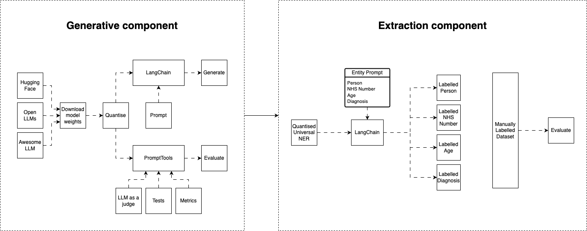

# Privacy FingerPrint Phase 2

### About the Project

[](https://github.com/GIScience/badges#experimental)

This repository holds code for Privacy Fingerprint. The aim of this project is to develop a modular tool that could be used to calculate a privacy risk score on unstructured clinical data.

This repository develops on previous work that initially looked at using ChatGPT (for the generative component) and Amazon Comprehend Medical (for the extraction component.)

_**Note:** Only public or fake data are shared in this repository._

## Project structure

The main sections of this repository are:

```text
+---data                              <- Folder where synthetic data is stored.                    
|
+---docs                              <- Folder to hold further documentation about the project.
|   |      model_card.md              <- A Markdown that provides more information about the code usage.
|
+---models                            <- Folder to hold all saved models to help run pipelines faster after configuration has been run.
|
+---notebooks                         <- Folder containing notebooks to explore each modules' code. 
|   +---generative_module             <- Folder containing notebooks that run the generative module.
|   +---extraction_module             <- Folder containing notebooks that run the extraction module.
|     
|
+---src                               <- Scripts with functions for use in .ipynb notebooks located in the notebooks folder.
|   +---ner_pipeline                  <- Contains scripts that can be used to run a named-entity-recognition pipeline.
|
|   .gitignore                        <- Files (& file types) automatically removed from version control for security purposes
|   config.toml                       <- Configuration file with parameters we want to be able to change (e.g. date)
|   environment.yml                   <- Conda equivalent of requirements file
|   pyproject.toml                    <- Configuration file containing package build information
|   LICENCE                           <- License info for public distribution
|   README.md                         <- Quick start guide / explanation of your project 
```

This diagram illustrates the current state of the project and the strcuture of each module.



### Built With

[](https://www.python.org/downloads/release/python-3110/)

### Getting Started

#### Installation

Assuming you have set up SSH credentials with this repository the package can be installed from Github directly by running:

`git clone https://github.com/nhsengland/privfp-gen-experiments.git`


#### Datasets

{DESCRIPTION AND LINKS TO DATASETS}

{LINK TO FAKE DATA TO SUPPORT INITAIL CODE RUNS}

## Generative Module 

### Dependencies

To create a suitable environment:
{PYENV EXAMPLE}
- ```python -m venv _env```
- `source _env/bin/activate`
- `pip install -r requirements.txt`

### Usage
{DESCRIPTION OF CODE}

### Outputs
{LIST AND DESCRIPTION OF OUTPUTS}

{NOTES ON REPRODUCIBILITY OF RESULTS}

## Extraction Module 

### Dependencies
{CONDA ENV EXAMPLE}
The first line of the `environment.yml` file sets the new environment's name.

```
conda env create -f environment.yml
conda activate <environment_name>
```
### Usage

In **./notebooks/extraction_module/ner_exploration** there is a set of notebooks exploring how to implement a range of named-entity-recognition models.

* **numind_NER.ipynb** explores a NER model created by Numind.
* **spacy_and_scispacy.ipynb** explores a range of NER models released by spacy.
* **spanMarker.ipynb** explores NER spanMarker model set-up and a possible intergration with spacy models.
* **uniNER_api.ipynb** explores the deployment of UniversalNER using an API. (This notebooks requires additional set-up, this involves cloning the [UniversalNER github](https://github.com/universal-ner/universal-ner), and then follow their instructions to server the model locally.)
* **uniNER_quantised.ipynb** requires a quantised version of UniversalNER:
    * This quantised model was created by cloning [llama.cpp repo](https://github.com/ggerganov/llama.cpp) and quantising the model yourself.

The **ner_pipeline.ipynb** (located in ./notebooks/extraction_module/) runs using the quantised model also used in uniNER_quantised.ipynb. 
This notebook allows a user to:
* Define a list of entities they want to extract from a given dataset.
* Generate a list of entities found in each patient by running on the quantised universalNER model locally.
* Save these patient's entities and load them back in.
* Validate these entities with a manually labelled dataset.


## Contributing

Contributions are what make the open source community such an amazing place to learn, inspire, and create. Any contributions you make are **greatly appreciated**.

1. Fork the Project
2. Create your Feature Branch (`git checkout -b feature/AmazingFeature`)
3. Commit your Changes (`git commit -m 'Add some AmazingFeature'`)
4. Push to the Branch (`git push origin feature/AmazingFeature`)
5. Open a Pull Request

_See [CONTRIBUTING.md](./CONTRIBUTING.md) for detailed guidance._

## License

Unless stated otherwise, the codebase is released under [the MIT Licence][mit].
This covers both the codebase and any sample code in the documentation.

_See [LICENSE](./LICENSE) for more information._

The documentation is [© Crown copyright][copyright] and available under the terms
of the [Open Government 3.0][ogl] licence.

[mit]: LICENCE
[copyright]: http://www.nationalarchives.gov.uk/information-management/re-using-public-sector-information/uk-government-licensing-framework/crown-copyright/
[ogl]: http://www.nationalarchives.gov.uk/doc/open-government-licence/version/3/

## Contact

**This repository is maintained by NHS England Data Science Team**.
To contact us raise an issue on Github or via [email](mailto:datascience@nhs.net)._

## Acknowledgements

- [Scarlett Kynoch](https://github.com/scarlett-k-nhs)
- [Xiyao Zhuang](https://github.com/xiyaozhuang)
- [Dan Schofield](https://github.com/danjscho)