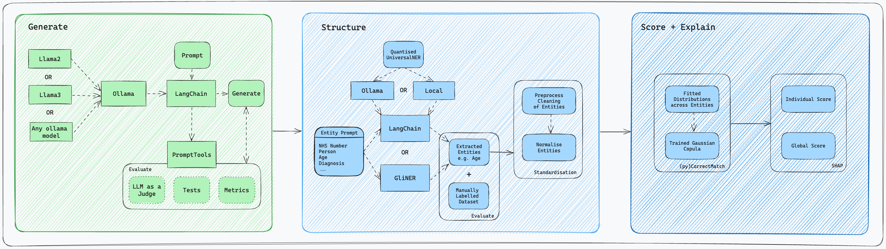

# Privacy FingerPrint (PrivFp) - Experiments
## Phase 2

## NHS England Data Science Team

### :warning: Warning to Users :warning:

**This codebase is a proof of concept and should only be used for demonstration purposes within a controlled environment. The components are not a live product and should not be deployed in a live or production environment.**

### About the Project

[](https://github.com/GIScience/badges#experimental)
[](https://github.com/psf/black)

This repository holds code for Privacy FingerPrint (PrivFp) - Phase 2 Experiments. The original proof of concept can be found [here](https://github.com/nhsengland/privfp-poc). The aim of the wider project is to develop a modular tool that could be used to calculate a privacy risk score on unstructured clinical data.

This repository develops on previous work that initially looked at using GPT-3.5 (for the generative component) and Amazon Comprehend Medical (for the extraction component), replacing those components with open equivalents.

_**Note:** Only public or fake data are shared in this repository._

## Project structure

The main sections of this repository are:

```text
+---data                                   <- Folder where synthetic data is stored
|
+---docs                                   <- MkDocs root directory
|   +---assets                             <- Additional assets for MkDocs
|   +---open-source-extraction-exploration <- Extraction component documentation
|   +---open-source-llm-exploration        <- LLM exploration documentation
|
+---models                                 <- Folder to hold all saved models to help run pipelines faster after configuration has been run
|
+---notebooks                              <- Folder containing notebooks to explore each modules' code
|   +---generative_module                  <- Folder containing notebooks that run the generative module
|   +---extraction_module                  <- Folder containing notebooks that run the extraction module
|
+---overrides                              <- Custom HTML for MkDocs
|
+---src                                    <- Scripts with functions for use in .ipynb notebooks located in the notebooks folder
|   +---ner_pipeline                       <- Contains scripts that can be used to run a named-entity-recognition pipeline
|
|   .gitignore                             <- Files (& file types) automatically removed from version control for security purposes
|   LICENCE                                <- License info for public distribution
|   mkdocs.yml                             <- MkDocs configuration file
|   README.md                              <- Quick start guide / explanation of the project
|   requirements_docs.txt                  <- Requiements needed to run MKdocs locally and develop.
|   requirements_scispacy.txt              <- Requirements needed to run the scispaCy notebook
|   requirements.txt                       <- Requirements to run all notebooks except where scispaCy is used
```

This diagram illustrates the current state of the project and the structure of each module.



## Getting Started

### Built With

[](https://www.python.org/downloads/release/python-3110/)

### Repo Installation

Assuming you have set up SSH credentials with this repository the package can be installed from Github directly by running:

`git clone https://github.com/nhsengland/privfp-experiments.git`

or via HTTPS or the GitHub CLI.

### Set-up

All of the set-up for this repository is located on the [mkdocs](https://nhsengland.github.io/privfp-experiments/). In brief, the docs covers installations on:

1. HomeBrew Installation
2. Julia Installation for (py)CorrectMatch
3. Environment Set-up
4. Setting up Synthea
5. Install Ollama and set-up Large Language Models
6. Install UniversalNER Locally

## Generative Module

### Usage

In **./notebooks/generative_module** there is a set of notebooks exploring how to run inference using different methods for different use cases.

### Outputs

- Generative example notes
- Evaluation scores

Note that a seed has not been implemented to reproduce the outputs shown.

###  License Agreements

This project uses Llama 2 and Llama 3 models from Meta AI. Usage of these models is governed by the non-commercial license provided by Meta.

#### Llama 2

Llama 2 is licensed under Meta's non-commercial license. For more details, please refer to [META's Llama 2 Licensing page](https://ai.meta.com/llama/license/).
To sign the corresponding license agreement you can apply for this via [huggingface](https://huggingface.co/meta-llama/Meta-Llama-3-70B).

#### Llama 3

Llama 3 is licensed under Meta's non-commercial license. For more details, please refer to [META's Llama 3 Licensing page](https://llama.meta.com/llama3/license/).
To sign the corresponding license agreement you can apply for this via [huggingface](https://huggingface.co/meta-llama/Llama-2-70b).

By using these models in this project, you agree to comply with the licensing terms provided by Meta.

For any commercial use or further inquiries, please contact Meta AI directly.

#### Llama 3.1

Llama 3.1 is licensed under Meta's non-commercial license. For more details, please refer to [META's Llama 3.1 Licensing page](https://llama.meta.com/llama3_1/license/).
To sign the corresponding license agreement you can apply for this via [huggingface](https://huggingface.co/meta-llama/Meta-Llama-3.1-8B-Instruct).

By using these models in this project, you agree to comply with the licensing terms provided by Meta.

For any commercial use or further inquiries, please contact Meta AI directly.

## Extraction Module

### Usage

In **./notebooks/extraction_module/ner_exploration** there is a set of notebooks exploring how to implement a range of named-entity-recognition models.

- **numind_NER.ipynb** explores a NER model created by Numind.
- **spacy_and_scispacy.ipynb** explores a range of NER models released by spaCy. (A different environment will be required to run SciSpacy.)
- **spanMarker.ipynb** explores NER spanMarker model set-up and a possible integration with spaCy models.
- **uniNER_quantised.ipynb** requires a quantised version of UniversalNER:

The quantised model was created by cloning [llama.cpp repo](https://github.com/ggerganov/llama.cpp) and quantising the Universal-NER/UniNER-7B-type locally to a `quantized_q4_1.gguf` format.

The llama.cpp repo has guidance on their repo in their **Prepare and Quantize** section. Alternatively their is a [medium article](https://medium.com/vendi-ai/efficiently-run-your-fine-tuned-llm-locally-using-llama-cpp-66e2a7c51300) that goes through all of this in a step-by-step process.

- **uniNER_api.ipynb** explores the deployment of UniversalNER using an API. (This involves using the [llama.cpp repo](https://github.com/ggerganov/llama.cpp) to server a quantised model.)

Extra guidance on serving a model in this repo is outlined in the [llama.cpp serving documentation](https://github.com/ggerganov/llama.cpp/blob/master/examples/server/README.md).


## Contributing

Contributions are what make the open source community such an amazing place to learn, inspire, and create. Any contributions you make are **greatly appreciated**.

1. Fork the Project
2. Create your Feature Branch (`git checkout -b feature/AmazingFeature`)
3. Commit your Changes (`git commit -m 'Add some AmazingFeature'`)
4. Push to the Branch (`git push origin feature/AmazingFeature`)
5. Open a Pull Request

_See [CONTRIBUTING.md](./CONTRIBUTING.md) for detailed guidance._

## Licence

Unless stated otherwise, the codebase is released under [the MIT Licence][mit].
This covers both the codebase and any sample code in the documentation.

_See [LICENSE](./LICENSE) for more information._

The documentation is [© Crown copyright][copyright] and available under the terms
of the [Open Government 3.0][ogl] licence.

[mit]: LICENCE
[copyright]: http://www.nationalarchives.gov.uk/information-management/re-using-public-sector-information/uk-government-licensing-framework/crown-copyright/
[ogl]: http://www.nationalarchives.gov.uk/doc/open-government-licence/version/3/

## Contact

**This repository is maintained by NHS England Data Science Team**.
To contact us raise an issue on Github or via [email](mailto:datascience@nhs.net).

## Contributors

- [Scarlett Kynoch](https://github.com/scarlett-k-nhs)
- [Xiyao Zhuang](https://github.com/xiyaozhuang)
- [Dan Schofield](https://github.com/danjscho)
- [Will Poulett](https://github.com/willpoulett)
