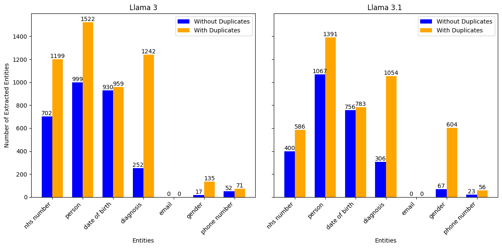
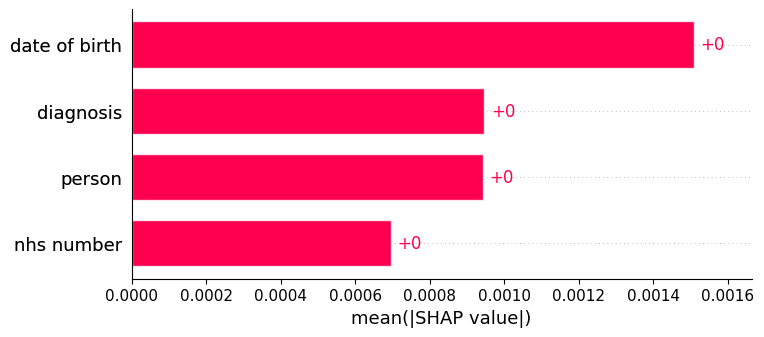
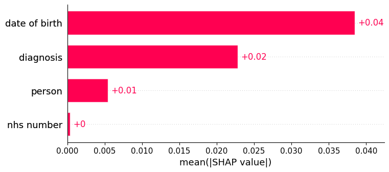

# Experiment 1.0

*This version of `Experiment 1.0` was run using the repo at commit [INSERT git SHA](), and looks to explore generic clinical notes containing four entities: `NHS Number`, `Person`, `Date of Birth`, and `Diagnosis`.  We also explore extracting further common entities which weren't explicitly injected.*

Let's run an experiment with the Privacy Fingerprint (PrivFp) pipeline to understand each modular component, and explore some of the things we can do within each section.

The majority of the experimentation done in this example was done following the structure in `notebooks/full_pipeline_example.ipynb`.

## Generating synthetic Patient Data with Synthea

First, we use step one of the `full_pipeline_example.ipynb` notebook to generate `1000` synthetic patient records. We specify `1000` by overriding the experimental config with the following line of code:

```console
experimental_config.synthea.population_num = "1000"
```

Interestingly, this returns to us a list of outputs with a length of `954`. Currently, our pipeline filters out duplicate patients and `"wellness encounters"`, so this is expected. We can use the fact that this data is in structured form to check that each record is unique by running the following python code:

```python
NHS_number_set = set([N["NHS_NUMBER"] for N in output_synthea])
print(len(NHS_number_set))
```

which returns `954`.

## Using a LLM to Generate Synthetic Medical Notes

PrivFp has the ability to use multiple different LLM's in a pipeline. In this experiment, we will use [Llama 3](https://ollama.com/library/llama3:8b) and [LLama 3.1](https://ollama.com/library/llama3.1), both with around 8 billion parameters.

We will use each model to turn each Synthea structured output into a synthetic medical note.  We use the supplied template prompt (c.f. [Llama 3 template](../../config/templates/generate/llama3_template.json)), but we could change this to see how this modifies our unstructured outputs.

Inspecting the outputs from both models, we notice a lot of notes start with: `"Here is a clinical note..."` or `"Clinical Note:"`. Clearly, our prompt needs some fine-tuning from someone with specific domain knowledge if we want our notes to be more realistic - as mentioned, this is again easy to change within our pipeline. 

Next, looking at NHS Numbers (remember these are synthetic), we see full stops, dashes and commas separating parts of the number. This makes it harder to use simple techniques like regular expressions to extract all NHS Numbers, and so we look to the more advanced methods of entity extraction. 

As we would like the NHS Numbers to be of a consistent format, we can run a quick test using regular expressions to see how many we can successfully extract. If they keep the correct format, we expect to see a ten digit number in the clinical note. 

We can use the following python code to count the number of times a ten digit number appears (assuming no spaces):

```python
import re

nhs_numbers_found = 0
pattern = r'\b\d{10}\b'

for note in output_llm:
    if re.search(pattern, note):
        nhs_numbers_found += 1
```

Using notes produced by `LLama 3.1` we find `473` NHS Numbers are returned and perhaps somewhat surprisingly, notes produced by `LLama 3` returns `895` NHS Numbers. 

## Re-extracting Entities from the Patient Medical Notes

We run extraction using `GLiNER` as our Named Entity Extraction Model. Looking at the plot below, typically more entities are extracted from clinical notes from `Llama 3` compared to `Llama 3.1`. This is most obvious with the 'NHS Numbers' entity. 


We also note that there are often duplicate entities extracted, and thus the total counts are well over `954`. Taking NHS Numbers from the `Llama 3` notes as an example, this means that multiple 'NHS Number' entities are extracted from some notes. Of the `532` notes that contain more than two 'NHS Number' entities, the majority of these come from strings containing "NHS Number" or similar, with `441` entities having the exact value "NHS Number". `886` reviews contain some 'NHS Number' entity. 

Again using our `Llama 3` example, looking at the `68` occasions where no 'NHS Number' was extracted, there are `9` NHS Numbers generated that can be picked up using our regular expression from earlier. One example of such a note is:

```
Here is a clinical note for Fannie Stroman's doctor:

Patient 8136111200, Fannie Stroman, born July 1st, 1970, was seen in the clinic today. She has been diagnosed with perennial allergic rhinitis and presents with ongoing symptoms of nasal congestion, itchy eyes, and sneezing throughout the year.
```

None of the other notes contain any text relating to "NHS Number".

### Additional Entities

We can also use `GLiNER` to investigate whether other entities are in the notes. Let us consider adding: `Email`, `Gender` and `Phone Number`.

We can add them to the entity extraction `entity_list` using the following code snippet:

```python
experimental_config.extraction.entity_list = [
    "nhs number",
    "person",
    "date of birth",
    "diagnosis",
    "email",
    "gender",
    "phone number"
]
```

In both `Llama 3` and `3.1`, we find that `GLiNER` was unable to extract any emails, but examples of genders and  phone numbers. Interestingly, the counts for the original entities, such as 'NHS Number' have fallen when additional entities were added (see plot below). For example, it may be that some NHS numbers were mistaken as phone numbers.



These interesting quirks when adding new entities support the use of our [annotation tool](../../SPIKE_annotation_tools/README.md). With this tool, you can annotate the notes and add new entities, alongside the entity extraction model. This tool can also help fine-tune the best names to give your entities. For example, `mobile number` may have been more effective than `phone number` in some cases.

## Normalising Entities Extracted for Scoring

The next step of the pipeline essentially turns our extraction data from a `JSON` format to tabular data. It does this using one-hot encoding, where each row in the tabular data refers to a single note. If two notes contained the same entities, they would have the same value in the corresponding one-hot encoded column. 

Currently, the first instance of an entity in the note is the one used for one-hot encoding. This has some issues. For example, we know that the string "NHS Number:" is often extracted as the 'NHS Number' entity. As this will often appear before the actual number in the notes, it is used instead when we one-hot-encode the data. This issue is something we are aware of, is planned to be fixed in future work, and we have performed some research on other methods of standardisation.

One simple fix (related to the above discussion) would be to ensure the 'NHS Number' entity contains numbers, or does not contain the string "NHS Number".

## Uniqueness of Standardised Entity Values

Once we have tabular data, we can start exploring the privacy risk around our dataset. We do this by estimating the uniqueness of each data point as a proxy for re-identification risk. The more unique the data, the more identifiable the individual is likely to be. 

The uniqueness is measured using `PyCorrectMatch` - see the docs for more details. A score of `1.0` means the row is unique, and `0.0` means all rows are the fundamentally the same. Currently, in our experiment, the lowest score for any row is 0.999. Therefore, every row is of high risk of re-identification. This makes sense, we have not attempted any de-identification steps. 

Let us imagine a theoretical de-identification technique that finds every single NHS Number in dataset and replaces it with a sentinel value. This would mean that in our one-hot encoded dataframe, all values in the 'NHS Number' column would be one of two values - `0` and `1`. An encoding of `0` would refer to NHS Numbers mapped to the sentinel value, and `1` would refer to no NHS Number being present. 

We can alter our transformed dataset using the following line of code:

```python
deid_dataset_1["nhs number"] = [random.randint(0, 1) for i in range(len(deid_dataset_1))]
```

Let's take this further and make an even more de-identified dataset where all persons are replaced with the initial of their first name, and thus the `person` column only contains `26` values.

```python
deid_dataset_1["person"] = [random.randint(0, 25) for i in range(len(deid_dataset_1))]
```

For the `date of birth` column, let's say that the data in de-identified by removing the day, and only keeping the month and year. Assuming all patients are aged between `1` and `80`, this would leave `960` possible months of birth, however we would expect some of duplicates. 

We run the below code to generate a random list with duplicates:

```python
dob_list = []
current_int = 0

for i in range(len(deid_dataset_1)):
    dob_list.append(current_int)
    if random.randint(0, 1):
        current_int+=1

random.shuffle(dob_list)
```

This has a small effect on our privacy score. Previously, the lowest score was `0.998`, whereas now it is `0.950`. The data is still heavily skewed towards `1.0`, meaning the majority of individuals are still highly re-identifiable. 

## Privacy Risk Explainer: SHAP

SHAP can be used as global and row-level measure of feature importance for a machine learning model's predictions.  In our case, SHAP will indicate which variables have the greatest effect on the privacy risk score.

For the raw `Llama 3` dataset using only the entities `person`, `nhs number`, `date of birth` and `diagnosis`, the global SHAP values are:



The `date of birth` entity has the greatest effect on predictions, followed by `diagnosis`, `person` and `nhs number`.

If we apply the de-identification steps we described above, we see the effect this has on the global SHAP values:



We see that `person` and `NHS number` now have a reduced impact on the score. This makes sense given our de-identification steps. 

## Traditional Privacy Metrics

Finally, our pipeline offers the ability to use traditional privacy metrics via [PyCanon](../pycanon/pycanon_and_privacy_metrics.md). These traditional metrics include `k-anonymity`, `t-closeness` and `l-diversity`. 

When applying any de-identification techniques, we get the following values:

- `k-anonymity`:  `1.0`
- `t-closeness`:  `0.852`
- `l-diversity`:  `1.0`

This implies that even with the de-identification of some of our sensitive values, there still exist specific records that are likely re-identifiable.

## Future Work

The are various additional routes of investigation that could be taken that we have not covered here.

#### Can we improve the prompt?
Excluding syntax, the prompt for project has not been iterated on since its initial creation for `Llama 2`.  This could be explored further, perhaps combining with techniques for optimising a prompt, such as few-shot prompting and chain of thought. Could we ensure all the relevant information is included in each note? For added realism, do we occasionally want some information to be in strange formats?

#### Are there better language models we can use?** 
We have been using the `Llama` series of LLMs, but could others be a good fit?

#### How can we improve our standardisation of the free text (i.e. before extraction)?
Are there steps we can take to put entities in free text, such as dates, in consistent forms to improve extraction? See our documentation for suggestions [here](../standardisation-research/standardising_entity_values.md).

#### How can we improve standardisation after extraction?
We have seen that often the text "NHS Number" is extracted alongside the real NHS number in a note, and currently we only use the first extracted entity. Can we integrate smarter ways to deal with this? See our documentation for suggestions [here](../standardisation-research/standardising_with_knowledge_graphs.md).

#### Are there better ways to score our privacy risk?
Is `PyCorrectMatch` the only option we should include? We have some research [here](../pycanon/pycanon_and_privacy_metrics.md).

#### How effective are traditional privacy risks?
How can we better compare our privacy risk score to traditional metrics?

#### How does the size of a dataset effect the privacy risk?
Do more notes always result in less identifiable records?

**Further suggestions are welcome!**