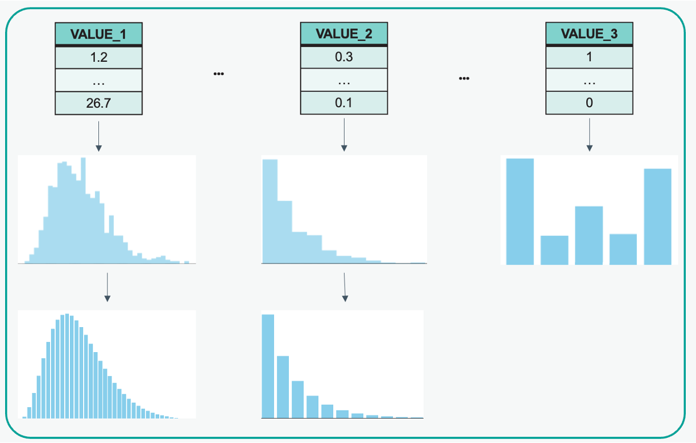
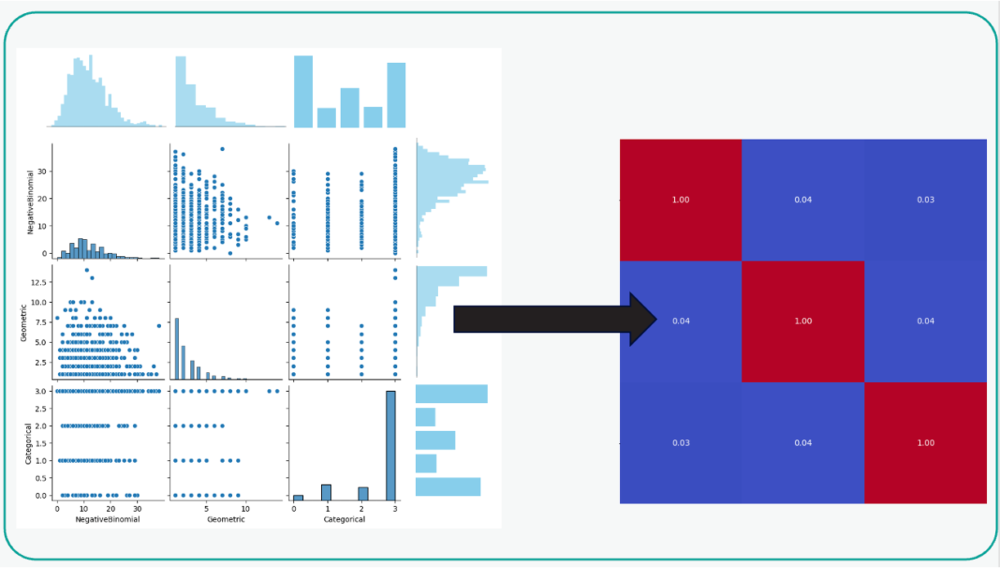
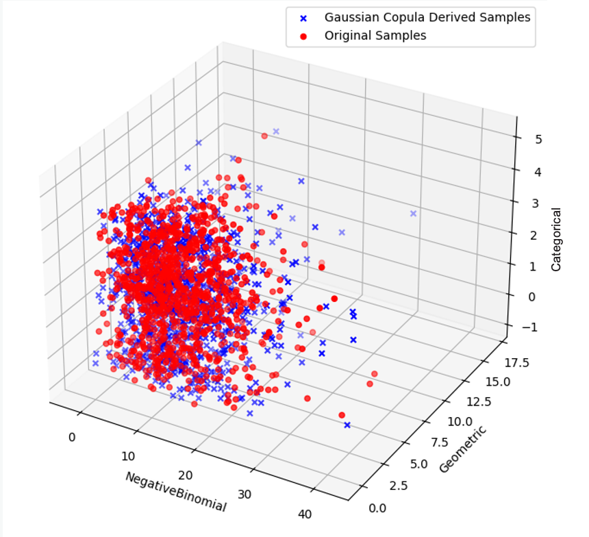
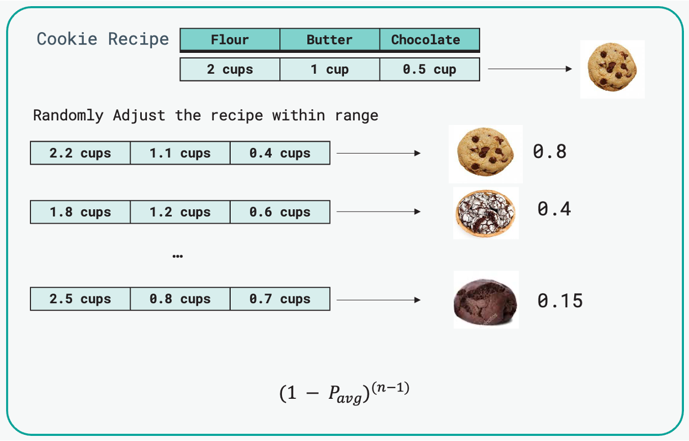

# How does Correct Match Work?

## 1.Extract the Empirical Marginal Distribution from each feature.

* A variety of marginal distributions are fitted to the feature data:
    * Negative Binomial
    * Geometric
    * Categorical (probability of frequency counts)
    * Logarithmic
* **Bayesian Information Criterion (BIC)** is used to determine the best fitting distirbution.

## 2.Extract the Correlation Matrix between features

## 3.Fit a Gaussian Copula using the estimated Marginal Distributions

* Gaussian Copula is fitted to the dataset using maximum likelihood estimation (MLE).
* An optimization procedure is performed to fit the correlation matrix of the Gaussian Copula. The optimization aims to minimize the difference between the calculated mutual information and the target mutual information.

## 4.Analogy to summarise how a fitted Gaussian Copula understands uniqueness of individuals and across a whole dataset.

* **Gaussian Copula Model**: Imagine you have a recipe for cookies that includes various ingredients like flour, sugar, chocolate chips, etc. Each ingredient represents a variable in your dataset, and the recipe captures the correlations between these ingredients (variables).
* **Generate Random Samples**: Now, instead of using exact measurements from the recipe, you randomly adjust the quantities of ingredients within reasonable ranges, maintaining the overall proportions specified by the recipe. These randomly adjusted ingredient quantities represent the random samples generated from the Gaussian copula model.
* **Calculate Cell Probabilities**: Estimating cell probabilities involves determining the likelihood of an individual data point (or in our analogy, a batch of cookies with specific ingredient quantities) falling into each combination of marginals within the joint distribution modelled by the Gaussian copula. Based on these observations, you estimate the probability of each combination of ingredient quantities producing the desired cookies. 

Similarly, in the data context, the smooth_weight function estimates the probability of each combination of discrete values for an individual's data based on the random samples generated from the Gaussian copula model.

