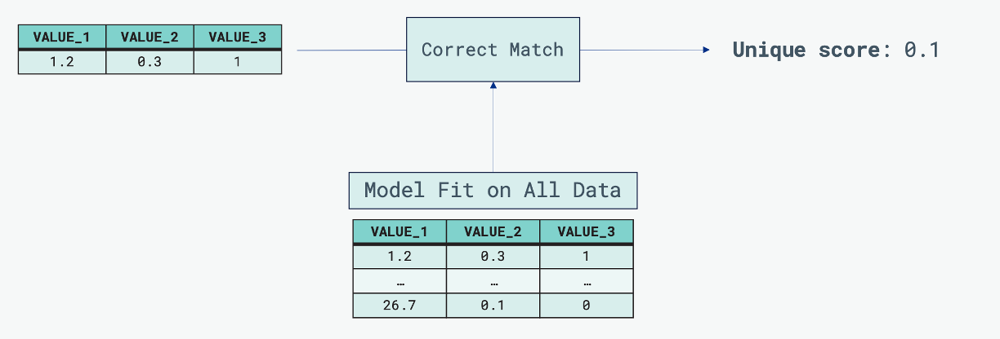

# What is (Py)Correct Match?

[Correct Match](https://github.com/computationalprivacy/CorrectMatch.jl) is a Julia module consisting of several components for analysing data uniqueness using a Gaussian copula model.

**Top Level Overview**: Gaussian copula model is trained across the whole dataframe, then this model is used to assess and extract the "uniqueness" score for each individual data point. 

