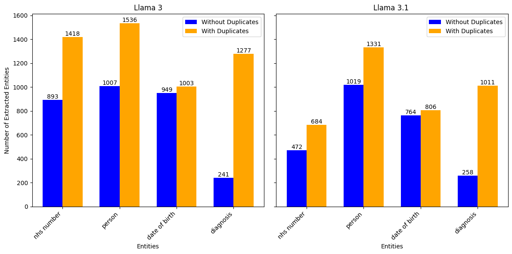
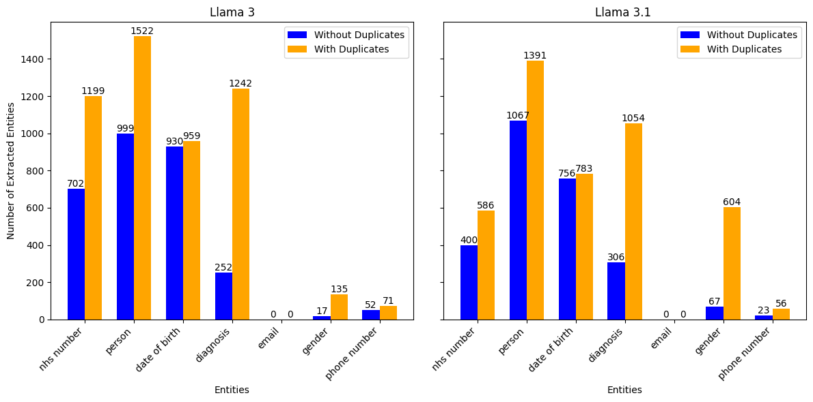
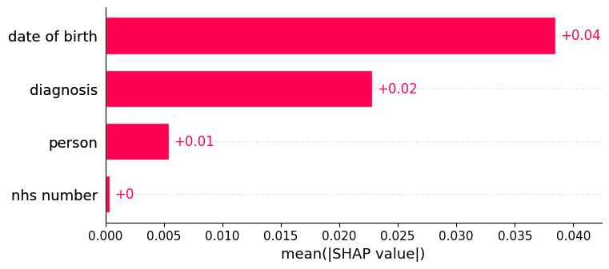

# Experiment 1

Let's run an experiment with the Privacy Fingerprint pipeline to understand each section of the pipeline, and explore some of the exploration and experiments we can do within each section. 

The majority of the experimentation done in this example was done following the structure in `notebooks/full_pipeline_example.ipynb`.

## Generating synthetic Patient Data with Synthea

First, we used step one of the `full_pipeline_example.ipynb` notebook to generate 1000 synthetic patient records. We specify 1000 by overriding the experimental config with the following line of code:

```console
experimental_config.synthea.population_num = "1000"
```

Interestingly, this returns to us a list of outputs with a length of 954. Currently, our pipeline filters out duplicate patients and wellness encounters, so this is expected. We can use the fact that this data is structured to still check that each record is unique by running the following python code:

```python
NHS_number_set = set([N["NHS_NUMBER"] for N in output_synthea])
print(len(NHS_number_set))
```

This returns 954. 

## Using a LLM to Generate Synthetic Medical Notes

We have the ability to use multiple LLM's in our pipeline. In this experiment, we will use [Llama 3](https://ollama.com/library/llama3:8b) and [LLama 3.1](https://ollama.com/library/llama3.1), both with 8 billion parameters.

We will use each model to turn each synthea output into a synthetic medical note.  

Inspecting the outputs of both, we notice a lot of notes start with: "Here is a clinical note..." or "Clinical Note:". Clearly, our prompt needs some fine-tuning if we want our notes to be more realistic. This is again easy to change within our pipeline. 

As a reminder, these NHS numbers are synthetic. In further examples we see full stops, dashes and commas seperating parts of the NHS number. This makes it impossible to use simple techniques like regular expressions to extract all NHS numbers, and so we must rely on more advanced methods of entity extraction. 

As we expect NHS numbers to be of a consistent format, we can run a quick test using regular expressions to see whether we can extract some NHS numbers. If NHS numbers keep the correct format, we expect to see a 10 digit number in the clinical note. We can use the following python code to count the number of times a 10 digit number appears.

```python
import re

nhs_numbers_found = 0
pattern = r'\b\d{10}\b'

for note in output_llm:
    if re.search(pattern, note):
        nhs_numbers_found += 1
```

Using LLama 3.1 we find 473 NHS Numbers are returned. Surprisingly , LLama 3 returns 895 NHS Numbers. 

## Re-extracting Entities from the Patient Medical Notes



We run extraction using Gliner as our Named Entity Extraction Model. Looking at the plot above, typically more entities are extracted from clinical notes from Llama 3 compared to Llama 3.1. This is most obvious with the `NHS Numbers` entity. 

We also note that there are always duplicate entities extracted, and often well over 954 entities extracted. Taking `NHS numbers` from the Llama 3 notes as an example, this means that multiple NHS numbers are extracted from some notes. Of the 532 reviews that contain more than two NHS number entities extracted, the majority of these come from strings containing "NHS number" or similar, with 441 entities having the value "NHS Number". 886 reviews contain some NHS number entity. 

Again using our Llama 3 example, looking at the 68 occasions where no NHS number was extracted, there are 9 NHS numbers generated that can be picked up using our regular expression from earlier. One example of such a note is:

```
Here is a clinical note for Fannie Stroman's doctor:

Patient 8136111200, Fannie Stroman, born July 1st, 1970, was seen in the clinic today. She has been diagnosed with perennial allergic rhinitis and presents with ongoing symptoms of nasal congestion, itchy eyes, and sneezing throughout the year.
```

None of the notes contain any text relating to "NHS number".

### Additional Entities

We can also use Gliner to investigate whether other entities are in the reviews. Let us consider adding: `email`, `gender` and `phone number`.

We can add them to the entitiy extraction entitiy list using the following code snippet:

```python
experimental_config.extraction.entity_list = [
    "nhs number",
    "person",
    "date of birth",
    "diagnosis",
    "email",
    "gender",
    "phone number"
]
```



In both Llama 3 and 3.1, we find that Gliner was unable to extract any emails, but examples of genders and  phone numbers. Interestingly, the counts for the original entities, such as 'NHS Number' have fallen when additional entities were added. For example, it may be that some NHS numbers were mistaken as phone numbers.

These interesting quirks when adding new entities support the use of our [annotation tool](../../SPIKE_annotation_tools/README.md). With this tool, you can annotate clinical notes and add new entities, alongside the entity extraction model. This tool will help you fine tune the best names to give your entities. For example, `mobile` may have been more effective than `phone number`.

## Normalising Entities Extracted for Scoring

The next step of the pipeline essentially turns our extraction data from a json format to tabular data. It does this using one hot encoding, where each row in the tabular data refers to a medical note id. If two notes contained the same medical number, they would have the same value in the "nhs number" one-hot encoded column. 

Currently, the first instance of an entity in the medical note is the one used for one hot encoding. This has some issues. For example, we know that "NHS Number:" is often extracted as the "nhs number" entity. As this will often appear before the NHS number in medical notes, it is used instead of the true NHS number when we one-hot-encode the data. This issue is something we are aware of, and we have done various research on other methods of standardisation.

One simple fix would be to ensure the NHS Number entitity contains numbers, or does not contain the string "NHS Number".

## Uniqueness of Standardised Entity Values

Once we have tabular data, we can start exploring the privacy risk of our data. We do this by estimating the uniqueness of each data point. The more unique the data, the more identifiable the individual is likely to be. 

The uniqueness is measured using PycorrectMatch, and documentation on how this works can be found at `docs/corect-match/`. To simplify, a score close to 1 means the row is incredibly unique, whilst a score close to 0 is not unique. Currently, the lowest score for any row is 0.999. Therefore, every row is highly reidentifiiable. 

This makes sense, we have not done any anonymisation steps. 

Let us imagine a theoretical anonymisation technique that finds every single NHS number in free text data and replaces it with a blank value. This would mean that in our one hot encoded dataframe, all values in the NHS number column would be one fo two numbers - 0 and 1. 0 would refer to an anonymised NHS number and 1 would refer to no NHS number being present. 

We can alter our transformed dataset using the following line of code:

```python
anonymised_dataset_1["nhs number"] = [random.randint(0,1) for i in range(len(anonymised_dataset_1))]
```

Let's take this further and make an even more anonymised dataset where all names are replaced with the initial of their first, and thus the `person` column only contains 26 values.

```python
anonymised_dataset_1["person"] = [random.randint(0,25) for i in range(len(anonymised_dataset_1))]
```

For the `date of birth` column let's say that the data in anonymised by removing the day, and only keeping the month and the year. Assuming all patients are between 1 and 80, this would leave 960 possible months of birth, however we would expect lots of duplicates. We run the below code to generate a random list with duplicates:

```python
list = []
current_int = 0

for i in range(len(anonymised_dataset_1)):
    list.append(current_int)
    if random.randint(0,1):
        current_int+=1

random.shuffle(list)
```

This has a small on our score. Previously, the lowest score was 0.998, whereas now it is 0.950. The data is still heavily skewed towards 1, meaning the majority of individuals are still highly  identifiable. 

## Privacy Risk Explainer: SHAP

SHAP is a measure of feature importance of a machine learning model by assigning each feature an importance value for each prediction. For the entire prediction, alongside individual results, SHAP will return which variables have the greatest effect on the privacy risk score.

For the non-anonymised Llama 3 dataset using only the entities "person", "nhs number", "date of birth" and "diagnosis", the global SHAP values are:


The `date of birth` entity has the greatest effect on predictions, followed by `diagnosis`, `person` and `nhs number`.

If we apply the anonymisation steps we described above, we see the effect this has on the global SHAP values:



We see that `person` and `NHS number` now have very little effect on the Privacy Risk Score. This makes sense given or anonymisation steps. 

## Traditional Metrics

Finally, our pipeline offers the ability to use traditional privacy metrics via [PyCanon](../pycanon/pycanon_and_privacy_metrics.md). These traditional metrics include k Anonymity, t closeness and l diversity. 

With and without any anonymisation techniques we get the following values:

- K-Anonymity:  1
- t-Closeness:  0.8521494940083337
- l-Diversity:  1

This implies that even with the anonymisation of some of our sensitive values, there still exist specific records that are likely reidentifiable. Further to this, the t closeness, which measures the spread of sensitive values in the sensitive value column remains constant as we have not applied any anonymisation steps to it.