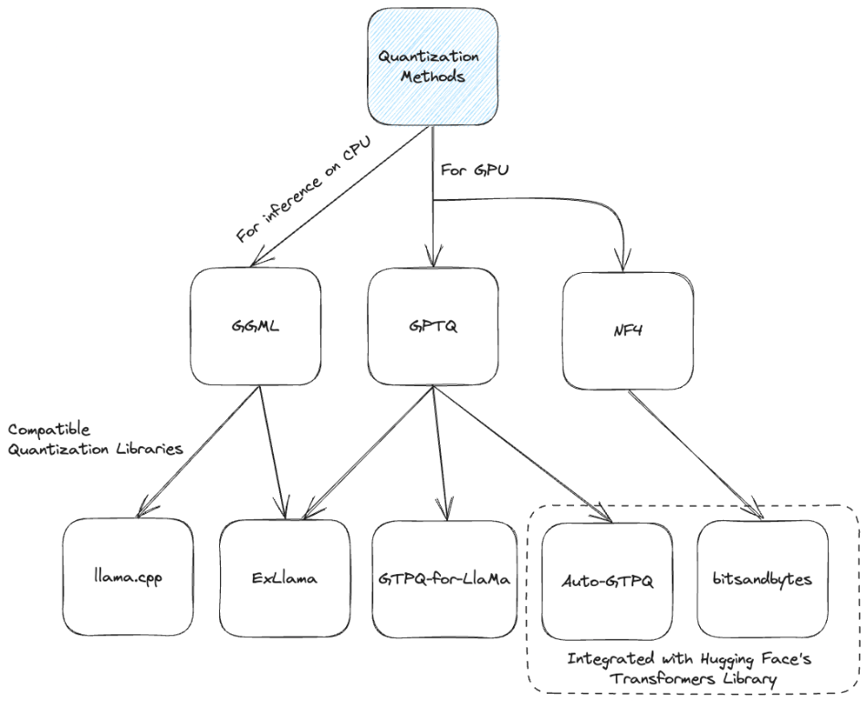

# Setting up open source LLMs

It is possible to run LLMs locally on consumer CPUs or GPUs with usable performance and inference speed. The following table contains a (non-exhaustive) list of projects which document the process of setting up a local open source LLM.

!!! info "Projects"

    === "llama.cpp"

        

        Note: GGML superseded by GGUF

        - Convert LLMs to GGML format and quantise
        - [Manifesto](https://github.com/ggerganov/llama.cpp/discussions/205)
        - Supports builds for many other LLMs
        - Building from source will require additional software e.g. Make, CMake, Zig or GMake.

        Important reading:

        - [GGML format](https://github.com/rustformers/llm/blob/main/crates/ggml/README.md)
        - [GGML project](https://github.com/ggerganov/ggml)

        Further reading:

        - [How llama.cpp is possible](https://finbarr.ca/how-is-llama-cpp-possible/)
        - [Python bindings for the Transformer models implemented in C/C++ using GGML library](https://github.com/marella/ctransformers)

        [GitHub :material-github:](https://github.com/ggerganov/llama.cpp){ .md-button .md-button--primary }

    === "Ollama"

        

        - Download and run pre-built LLMs locally from the [ollama.ai](https://ollama.ai/library) library
        - Supports LLMs not in their library by importing GGUF files

        [GitHub :material-github:](https://github.com/jmorganca/ollama){ .md-button .md-button--primary }

    === "PrivateGPT"

        Production-ready AI project that allows you to ask questions about your documents.

        [GitHub :material-github:](https://github.com/imartinez/privateGPT){ .md-button .md-button--primary }

    === "GPT4ALL"

        LLMs that run locally on your CPU and nearly any GPU.
        
        [GitHub :material-github:](https://github.com/nomic-ai/gpt4all){ .md-button .md-button--primary }

    === "TheBloke"

        Pre-built quantised LLMs on HuggingFace.

        [Hugging Face :hugging:](https://huggingface.co/TheBloke){ .md-button .md-button--primary }

    === "ExLlamaV2"

        Inference library for running local LLMs on modern consumer GPUs.

        [GitHub :material-github:](https://github.com/turboderp/exllamav2){ .md-button .md-button--primary }

## Quantisation

The ability to run LLMs on consumer grade hardware has been achieved by quantisation or "rounding" of floating point data types. This is accomplished by mapping floating point ranges into more compact integer representations for example, quantising the range (-1.0, ..., 1.0) to (-127, -126, ..., 126, 127). The following links provide a nice introduction to floating point data types and quantisation techniques.

- [Introduction to 8-bit quantisation](https://huggingface.co/blog/hf-bitsandbytes-integration)
- [4-bit quantisation](https://huggingface.co/blog/4bit-transformers-bitsandbytes)

!!! abstract "Good reads"

    Introduction to open source LLMs.

    - [The History of Open-Source LLMs - Early Days (Part One)](https://cameronrwolfe.substack.com/p/the-history-of-open-source-llms-early)
    - [The History of Open-Source LLMs - Better Base Models (Part Two)](https://cameronrwolfe.substack.com/p/the-history-of-open-source-llms-better)