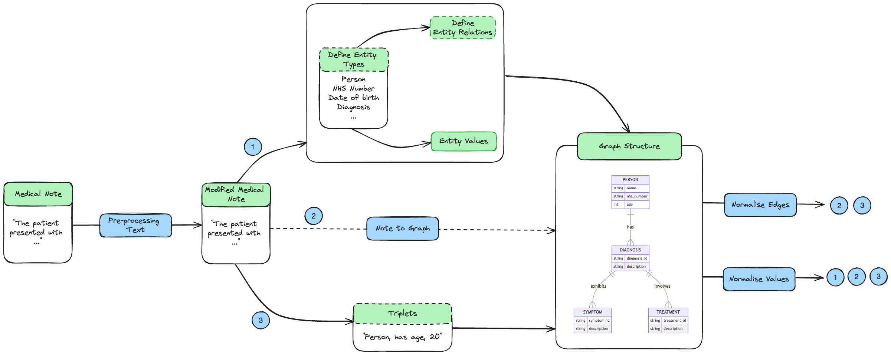

# Standardisation

The main aim of this standardisation spike was to explore methods for standardizing outputs from extracting information from medical notes.

## Pre-processing Text

We would want to consider expanding out acronyms in this space. It would be good to evaluate the effect of these two acronym expanders:

- **[Ab3P](https://github.com/ncbi-nlp/Ab3P)**: Biomedical Specific acronym expansion tool has been trained on PubMed Abstracts.
- **[Spacy AbbrX](https://github.com/erre-quadro/spikex)**: Uses a pre-trained spacy models to expand out acronyms.

You could consider spell checkers, but spell checkers can overcompensate and correct words into those that have alternative meanings.

## Document to Graph

This covers possible approaches to transform a document into a graph structure.

### Method 1: Text to NER and Relation Extraction to Graph

1. Define your entity types, these would be defined by working ideally with the annotator tool to identify all possible entities.

2. Extract out entity values associated with entity type using [GliNER](https://github.com/informagi/REL).

3. Define relationships between entity types. Create an interface which allows users to define relationships between entity types.
    * **Pros:** Generalist approach and keeps a human in the loop.
    * **Cons:**
        - Assumes one diagnosis links to symptoms/medication proposed in text isn't always true.
        - You might need to break documents down into extracting out known PID data and this is linked to a patient, and everything else is broken down into sentences and connected back.
        - This might even include overlapping sentences to find where one sentence runs into another.

4. Use [NetworkX](https://github.com/networkx/networkx) to create your graph and [PyVis](https://pyvis.readthedocs.io/en/latest/) for visualizing the graph structure.

### Method 2: Text to Graph - Space for this is growing so is one to watch.

This is a growing space, this is one approach.

1. **[Text2Graph](https://github.com/xyjigsaw/Text2Graph?tab=readme-ov-file)**
    * **Limitations:**
        - Probabilistic so the graph varies on each iteration.
        - Computationally expensive.
        - Involves resolving relationships between entities and entity types.

### Method 3: Text to Triplet to Graph - Move away from the current approach.

We would want to evaluate between some approaches such as:

1. **[REBEL](https://huggingface.co/Babelscape/rebel-large):**
    * **Limitations:**
        - Bert-based so can only transform 512 tokens at a time. (Consider breaking up the sentence.)
        - Probabilistic so the graph varies on each iteration.
        - Computationally expensive.

2. **[OpenIE Standalone Github Repository](https://github.com/neo4j-graph-examples/entity-resolution)**
    * **Limitations:**
        - Rule-based approach meaning, unless handled for, triplets extracted are related to the context in the text. This could result in more thorough cleaning needed.
        - To counteract the above you could consider using [OpenNRE](https://github.com/thunlp/OpenNRE) to extract relations out of the triplets, and make a substitution in the middle triplet.

## Additional Post-processing Steps to Consider

### Resolving Entity Relations (Normalising Edges)

Graphs can be converted back into triplets so [OpenNRE](https://github.com/thunlp/OpenNRE) could be used to extract out the relation between triplets.

**Limitations:**

1.  Not all relations could be extracted out via OpenNRE.
2. Different phrases could still generate different relations from the triplets presented.

### Resolving Entity Values (Normalising Values)

1. Design a Generalised approach: This will be the default normalisation process, so would allow individuals to consider additional entities.
    * Applying simple NLP techniques (lowercasing, removing punctuation) - Low Code
    * High Code Implementation (Either Or)
        * **Wikification** - [Wikimapper](https://pypi.org/project/wikimapper/) is likely the easiest package to implement quickly.
            * **Limitation:**: If a value is None - it could be assigned a Null value.
        * **String Comparison between entities**
            * **Limitations:** You would need to determine a cut-off point to determine whether phrases are the same.
        * **Wikification + String Comparison:** Use Wikification, and for values assigned None you could consider String Comparison for a high cut-off point.
2. **Entity type specific:** We likely want to handle specific entities in a certain way and have a generalised way to begin with
    * **Person:** Explore out extending out the different parts that makes a name.
        * **[Probable People](https://github.com/datamade/probablepeople):** A library for parsing and formatting person names.
        *  **[Python Nameparser](https://github.com/derek73/python-nameparser):** An alternative library for parsing human names.
        * **[Nominally](https://github.com/vaneseltine/nominally):** Another tool for parsing names.
    * **Date of Birth:** Normalise using [DateParser](https://dateparser.readthedocs.io/en/latest/)
        * **Limitation:**
            * DateParser will provide None if the value doesn't exist.
            * DateParser will set something to 01 if the value doesn't exist in the date causing these values to overweight.
3. **NHS Number:** Extract this using Regex.
4. **Diagnosis:** This is an example of a medically related entity. We might want to consider mapping medically related entities to ICD 10/ SNOMED Codes
    * **[ICD10cm Augmented](https://nlp.johnsnowlabs.com/2021/11/01/sbiobertresolve_icd10cm_augmented_billable_hcc_en.html)**
    * **[SNOMED CT Entity Linking Challenge](https://github.com/drivendataorg/snomed-ct-entity-linking)**
